# fitport
Making my old Fitbit Data useful again.
___

## Goals
1. Port Fitbit Data to Apple Health
   - [ ] Weight
   - [ ] Sleep
   - [ ] Resting HR
   - [ ] Demographic VO2 Max
   - [ ] Steps
   - [ ] Workouts
   - [ ] Running + Walking Distance
2. Create Unified Database of all Health Data
3. Make Pretty Graphs
___
## Data Structure
_Fitbit Data Export Tool gives the following_
```text
data/user-site-export
├── altitude
├── calories
├── demographic_vo2_max
├── distance
├── exercise
├── heart_rate
├── lightly_active_minutes
├── moderately_active_minutes
├── resting_heart_rate
├── run_vo2_max
├── sedentary_minutes
├── sleep
├── steps
├── time_in_heart_rate_zones
├── very_active_minutes
└── weight
```
___
## Step 1: Weight & BMI
```json5
[{
  // Example Weight Record
  "logId" : 1431993599000,
  "weight" : 191.8, // weight in pounds
  "bmi" : 27.77,
  "date" : "05/18/15", // MM/DD/YY
  "time" : "23:59:59"
},{
  "logId" : 1499258640000,
  "weight" : 193.9,
  "bmi" : 28.08,
  "fat" : 24.00200080871582,
  "date" : "07/05/17",
  "time" : "12:44:00",
  "source" : "Aria"
},{
  "logId" : 1499299199000,
  "weight" : 189.1,
  "bmi" : 27.39,
  "fat" : 25.299999237060547,
  "date" : "07/05/17",
  "time" : "23:59:59",
  "source" : "API"
}]
```
**Shortcuts Weight, BMI, Lean Mass, Fat Percentage Health Sample**
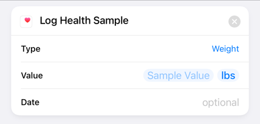
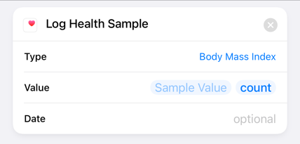
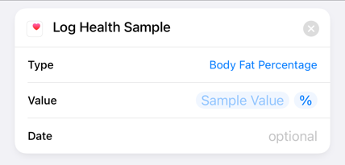
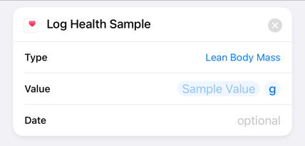

```text
Date: .date + .time
Weight: .weight in pounds
BMI: .bmi
Body Fat %: .fat in %
Lean Body Mass: .weight * ( 1 - .fat )
```
___
## Step 2: Sleep
```json5
// Example Sleep Record
{
  "logId" : 1028309330,
  "dateOfSleep" : "2015-06-16",
  "startTime" : "2015-06-15T23:46:00.000",
  "endTime" : "2015-06-16T10:19:10.000",
  "duration" : 37980000,
  "minutesToFallAsleep" : 7,
  "minutesAsleep" : 608,
  "minutesAwake" : 18,
  "minutesAfterWakeup" : 0,
  "timeInBed" : 633,
  "efficiency" : 97,
  "type" : "classic",
  "infoCode" : 0,
  "levels" : {
    "summary" : {
      "restless" : {
        "count" : 14,
        "minutes" : 24
      },
      "awake" : {
        "count" : 1,
        "minutes" : 1
      },
      "asleep" : {
        "count" : 0,
        "minutes" : 608
      }
    },
    "data" : [{
      "dateTime" : "2015-06-15T23:46:00.000",
      "level" : "restless", // restless, asleep, awake
      "seconds" : 360
    }, {
      "dateTime" : "2015-06-15T23:52:00.000",
      "level" : "awake", // restless, asleep, awake
      "seconds" : 60
    }]
  },
  "mainSleep" : true
}
```
**Shortcuts Sleep Entry**
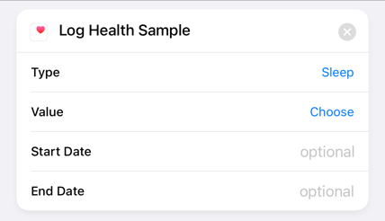
```
Type: Sleep
Value: [ Awake, In Bed, Asleep ]
Start Date: ...
End Date: ...
```
___
## Step 3: Resting HR
```json5
// Example Resting HR Record
[{
  "dateTime" : "05/18/18 00:00:00",
  "value" : {
    "date" : "05/18/18",
    "value" : 70.40722942352295,
    "error" : 14.206387519836426
  }
},{
  "dateTime" : "05/19/18 00:00:00",
  "value" : {
    "date" : null, // Some records include nulls, ignore these
    "value" : 0.0,
    "error" : 0.0
  }
}]
```
**Shortcuts Resting HR Entry**
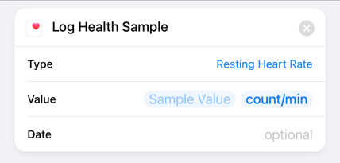
___
## Step 4: Demographic VO2 Max
```json5
// Example Demographic VO2 Max Record
[{
  "dateTime" : "01/12/17 00:00:00",
  "value" : {
    "demographicVO2Max" : 45.97793,
    "demographicVO2MaxError" : 3.0000000000000004,
    "filteredDemographicVO2Max" : 45.97793,
    "filteredDemographicVO2MaxError" : 3.0000000000000004
  }
},{
  "dateTime" : "01/13/17 00:00:00",
  "value" : {
    "demographicVO2Max" : 46.294610000000006,
    "demographicVO2MaxError" : 3.0000000000000004,
    "filteredDemographicVO2Max" : 46.13758000000001,
    "filteredDemographicVO2MaxError" : 1.5123900000000001
  }
}]
```
```json5
// Example Run VO2 Max Record
[{
  "dateTime" : "06/12/17 11:02:32",
  "value" : {
    "exerciseId" : 8206037238,
    "runVO2Max" : 41.74506,
    "runVO2MaxError" : 3.9423800000000004,
    "filteredRunVO2Max" : 43.65448000000001,
    "filteredRunVO2MaxError" : 3.0453400000000004
  }
},{
  "dateTime" : "07/09/17 01:13:50",
  "value" : {
    "exerciseId" : 8694642429,
    "runVO2Max" : 51.226350000000004,
    "runVO2MaxError" : 5.99073,
    "filteredRunVO2Max" : 46.85886000000001,
    "filteredRunVO2MaxError" : 2.53525
  }
}]
```
**VO2 Max is Entered via Cardio Fitness**
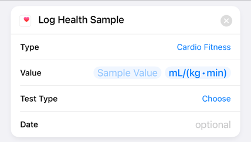
```text
Type: Cardio Fitness
Value: 0 mL/(kg x min)
Test Type (opt.): [ Max Exercise Test, Sub-Max Exercise Prediction, Non-Exercise Prediction ]
Date: ...
```
___
## Step 5: Steps
```json5
// Example Steps Record
[{
  "dateTime" : "03/20/17 23:54:00",
  "value" : "0"
},{
  "dateTime" : "03/20/17 23:55:00",
  "value" : "68"
},{
  "dateTime" : "03/20/17 23:56:00",
  "value" : "82"
},{
  "dateTime" : "03/20/17 23:57:00",
  "value" : "107"
},{
  "dateTime" : "03/20/17 23:58:00",
  "value" : "108"
}]
```
**Shortcuts Steps Entry**
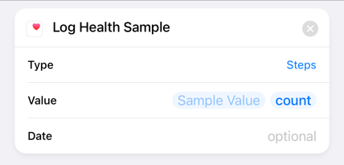
___
## Step 6: Workouts
```json5
// Example Run Exercise/Workout Record
{
  "logId" : 253307636,
  "activityName" : "Run",
  "activityTypeId" : 90009,
  "activityLevel" : [{
    "minutes" : 0,
    "name" : "sedentary"
  },{
    "minutes" : 0,
    "name" : "lightly"
  },{
    "minutes" : 0,
    "name" : "fairly"
  },{
    "minutes" : 45,
    "name" : "very"
  }],
  "averageHeartRate" : 155,
  "calories" : 655,
  "distance" : 4.345576,
  "distanceUnit" : "Kilometer",
  "duration" : 2707000,
  "activeDuration" : 2707000,
  "steps" : 5324,
  "source" : {
    "type" : "tracker",
    "name" : "Charge HR",
    "id" : "31739289",
    "url" : "https://www.fitbit.com/",
    "trackerFeatures" : ["GPS","CALORIES","DISTANCE","STEPS","PACE","HEARTRATE","ELEVATION"]
  },
  "logType" : "tracker",
  "manualValuesSpecified" : {
    "calories" : false,
    "distance" : false,
    "steps" : false
  },
  "heartRateZones" : [{
    "name" : "Out of Range",
    "min" : 30,
    "max" : 99,
    "minutes" : 0
  },{
    "name" : "Fat Burn",
    "min" : 99,
    "max" : 139,
    "minutes" : 9
  },{
    "name" : "Cardio",
    "min" : 139,
    "max" : 169,
    "minutes" : 22
  },{
    "name" : "Peak",
    "min" : 169,
    "max" : 220,
    "minutes" : 14
  }],
  "speed" : 5.779118433690432,
  "pace" : 622.9323799652796,
  "lastModified" : "08/09/15 01:55:22",
  "startTime" : "06/22/15 06:14:49",
  "originalStartTime" : "06/22/15 06:14:49",
  "originalDuration" : 2707000,
  "elevationGain" : 54.864,
  "hasGps" : false,
  "shouldFetchDetails" : false
}
```

```json5
// Example  Walk Exercise/Workout Record
{
  "logId" : 221972911,
  "activityName" : "Walk",
  "activityTypeId" : 90013,
  "activityLevel" : [{
    "minutes" : 9,
    "name" : "sedentary"
  },{
    "minutes" : 13,
    "name" : "lightly"
  },{
    "minutes" : 1,
    "name" : "fairly"
  },{
    "minutes" : 26,
    "name" : "very"
  }],
  "averageHeartRate" : 95,
  "calories" : 335,
  "distance" : 2.88054, 
  "distanceUnit" : "Kilometer",
  "duration" : 2998000, // Milliseconds
  "activeDuration" : 2998000, // Milliseconds
  "steps" : 3919,
  "source" : {
    "type" : "tracker",
    "name" : "Charge HR",
    "id" : "31739289",
    "url" : "https://www.fitbit.com/",
    "trackerFeatures" : ["GPS","CALORIES","DISTANCE","STEPS","PACE","HEARTRATE","ELEVATION"]
  },
  "logType" : "tracker",
  "manualValuesSpecified" : {
    "calories" : false,
    "distance" : false,
    "steps" : false
  },
  "heartRateZones" : [{
    "name" : "Out of Range",
    "min" : 30,
    "max" : 99,
    "minutes" : 24
  },{
    "name" : "Fat Burn",
    "min" : 99,
    "max" : 139,
    "minutes" : 26
  },{
    "name" : "Cardio",
    "min" : 139,
    "max" : 169,
    "minutes" : 0
  },{
    "name" : "Peak",
    "min" : 169,
    "max" : 220,
    "minutes" : 0
  }],
  "speed" : 3.4589539693128755, // Kilometres/hour
  "pace" : 1040.7770765203747, // Seconds/Kilometre
  "lastModified" : "08/09/15 01:55:22", // MM/DD/YY HH:MM:SS
  "startTime" : "05/19/15 02:01:19", // MM/DD/YY HH:MM:SS
  "originalStartTime" : "05/19/15 02:01:19", // MM/DD/YY HH:MM:SS
  "originalDuration" : 2998000, // Milliseconds
  "elevationGain" : 27.432,
  "hasGps" : false,
  "shouldFetchDetails" : false
}
```
**Shortcuts Running Workout Entry**
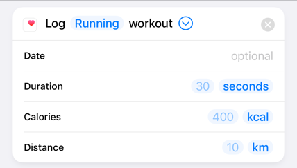

**Shortcuts Walking Workout Entry**
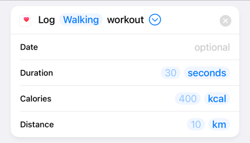
___
Step 7: Running + Walking Distance
```json5
// Example Distance Record
[{
  "dateTime" : "12/13/15 01:20:00", // MM/DD/YY HH:MM:SS
  "value" : "0" // centimetres
},{
  "dateTime" : "12/13/15 01:21:00", // MM/DD/YY HH:MM:SS
  "value" : "441" // centimetres
},{
  "dateTime" : "12/13/15 01:22:00", // MM/DD/YY HH:MM:SS
  "value" : "1544" // centimetres
}]
```
**Shortcuts Walking + Running Distance Entry**
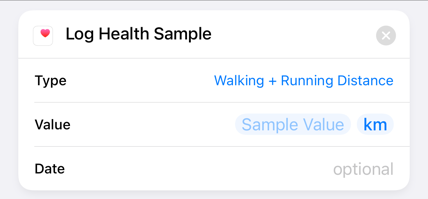